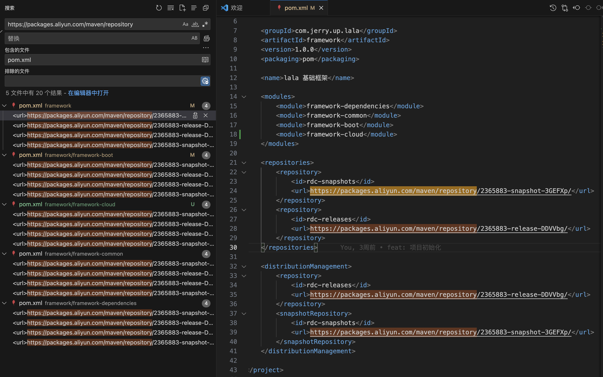
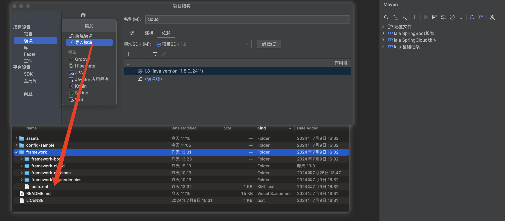
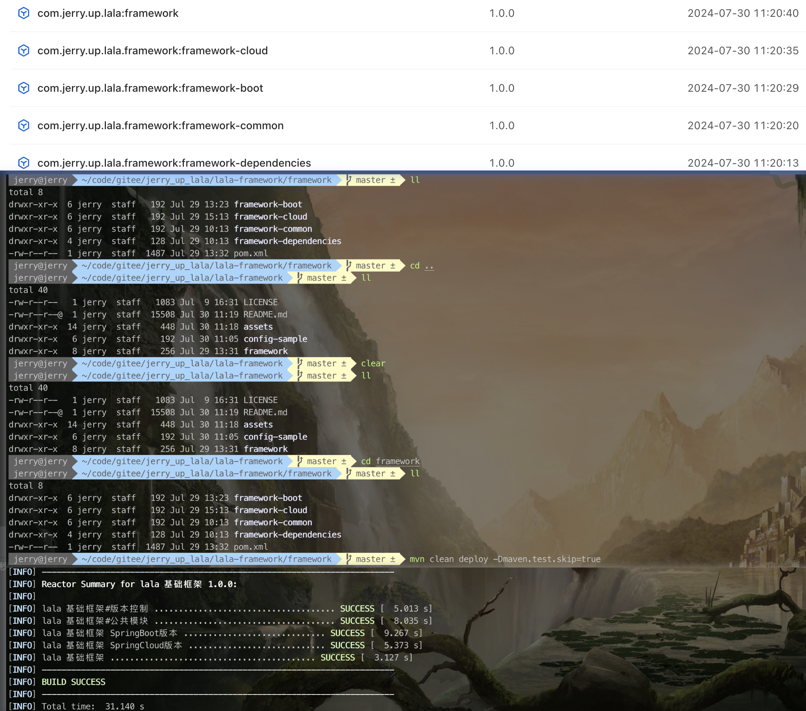

<!-- markdownlint-disable -->
<p align="center">
  
</p>
<h1 align="center">jerry-up · lala · lala-framework</h1>
<h4 align="center">微服务开发的基础框架</h4>
<p align="center">
    
    <a href="./LICENSE" target="_blank">
        
    </a>
</p>
<p align="center">
    <a href="https://docs.spring.io/spring-boot/docs/2.7.14/reference/html" target="_blank">
        
    <a href="https://docs.spring.io/spring-cloud/docs/2021.0.8/reference/html">
        
    </a>
    <a href="https://spring-cloud-alibaba-group.github.io/github-pages/2021/zh-cn/2021.0.5.0">
        
    </a>
</p>


## 1. 技术栈

### 1.1. 依赖框架

| 框架  | 版本 | 说明 |
| ---- | ---- | ---- |
| [Spring Boot](https://spring.io/projects/spring-boot) | [2.7.14](https://docs.spring.io/spring-boot/docs/2.7.14/reference/html/) | 简化 Spring 应用的创建及部署 |
| [Spring Cloud](https://spring.io/projects/spring-cloud) | [2021.0.8](https://docs.spring.io/spring-cloud/docs/2021.0.8/reference/html/) | 快速构建分布式系统 |
| [Spring Cloud Alibaba](https://sca.aliyun.com/) | [2021.0.5.0](https://spring-cloud-alibaba-group.github.io/github-pages/2021/zh-cn/2021.0.5.0/) | 微服务开发的一站式解决方案 |
| [Druid](https://github.com/alibaba/druid/wiki) | [1.2.18](https://github.com/alibaba/druid/releases/tag/1.2.18) | JDBC 组件库 |
| [MyBatis-Plus](https://baomidou.com/) | [3.5.3.2](https://github.com/baomidou/mybatis-plus/releases/tag/v3.5.3.2) | [MyBatis](https://www.mybatis.org/mybatis-3/)的增强工具 |
| [MyBatis-Plus-Join](https://yulichang.github.io/mybatis-plus-join-doc/) | [1.4.6](https://gitee.com/best_handsome/mybatis-plus-join/tree/v1.4.6) | 在 [MyBatis-Plus](https://baomidou.com/) 的基础上提供连表操作 |
| [Redisson](https://redisson.org/) | [3.17.4](https://github.com/redisson/redisson/releases/tag/redisson-3.17.4) | 简单的 Redis Java 客户端 & 实时数据平台 |
| [Sa-Token](https://sa-token.cc/index.html) | [1.34.0](https://gitee.com/dromara/sa-token/releases/tag/v1.34.0) | 轻量级 Java 权限认证框架 |
| [Hutool](https://hutool.cn/docs/#/) | [5.8.25](https://hutool.cn/docs/#/CHANGELOG?id=_58252024-01-11) | 小而全的 Java 工具类库 |
| [Lombok](https://projectlombok.org/) | [1.18.24](https://projectlombok.org/changelog) | 通过注解简化代码 |
| [Transmittable-Thread-Local](https://github.com/alibaba/transmittable-thread-local) | [2.14.3](https://github.com/alibaba/transmittable-thread-local/releases/tag/v2.14.3) | 提供 `ThreadLocal` 值的传递功能，解决异步执行时上下文传递的问题 |

### 1.2. 中间件

- framework-boot

| 中间件                                      | 版本                                                         | 说明               |
| ------------------------------------------- | ------------------------------------------------------------ | ------------------ |
| [MySQL](https://www.mysql.com/)             | [5.7.36](https://dev.mysql.com/doc/relnotes/mysql/5.7/en/news-5-7-36.html) | 关系型数据库       |
| [Redis](https://redis.io)                   | [6.2.13](https://github.com/redis/redis/releases/tag/6.2.13) | 缓存数据库         |
| [Nacos](https://nacos.io/zh-cn/)            | [2.2.0](https://github.com/alibaba/nacos/releases/tag/2.2.0) | 配置中心，注册中心 |
| [RocketMQ](https://rocketmq.apache.org/zh/) | [5.0.0](https://github.com/apache/rocketmq/releases/tag/rocketmq-all-5.0.0) | 消息队列           |

- framework-cloud

| 中间件                                  | 版本                                                         | 默认端口       | 默认用户名/密码   |
| ------------------------------------------- | ------------------------------------------------------------ | -------------- | ----------------- |
| [Seata](https://seata.io/zh-cn/)            | [1.6.1](https://github.com/seata/seata/releases/tag/v1.6.1) | 7091,8091      |                   |
| [Sentinel](https://sentinelguard.io/zh-cn/) | [1.8.6](https://sentinelguard.io/zh-cn/blog/sentinel-1-8-6-release.html) | 8080           | sentinel/sentinel |

## 2. 目录说明

```sh
lala-framework
    └──config-sample #配置样例
    └──framework #代码
       └─framework-dependencies #依赖管理
       |   └─pom.xml
       └─framework-common #公共模块
       |    └─src
       |    |   └─main
       |    |      └─java (源码包)
       |    |      │   └─com.jerry.up.lala.framework.common
       |    |      │        ├─annotation #注解
       |    |      │        ├─constant #常量
       |    |      │        ├─exception #异常
       |    |      │        ├─model #公共模型
       |    |      │        ├─r #统一返回对象
       |    |      │        └─util #工具类
       |    |      └───resources
       |    |          └─logback-common.xml #日志配置
       |    └─pom.xml
       └─framework-boot #SpringBoot版本
       |    └─src
       |    |   └─main
       |    |      └─java (源码包)
       |    |      │   └─com.jerry.up.lala.framework.boot
       |    |      │        ├─api #控制层处理
       |    |      │        ├─crypto #加密/解密
       |    |      │        ├─entity #实体
       |    |      │        ├─excel #Excel处理
       |    |      │        ├─exception #统一异常处理
       |    |      │        ├─mapper # 持久层Mapper接口
       |    |      │        ├─mybatis #MyBatis配置
       |    |      │        ├─page #分页
       |    |      │        ├─properties #配置类
       |    |      │        ├─redis #Redis配置
       |    |      │        ├─request #请求处理
       |    |      │        ├─response #响应处理
       |    |      │        ├─satoken #Sa-Token配置
       |    |      │        └─tenant #租户处理
       |    |      └───resources
       |    |          ├─mapper #MyBatis xml文件
       |    |          ├─templates #模板
       |    |          ├─private.txt # RSA 公钥
       |    |          └─public.txt # RSA 私钥
       |    └─pom.xml
       └─framework-cloud #SpringCloud版本
       |    └─src
       |    |   └─main
       |    |      └─java (源码包)
       |    |         └─com.jerry.up.lala.framework.cloud
       |    |              └─feign #服务间调用
       |    └─pom.xml
       └─pom.xml
```

## 3. 快速开始

### 3.1. 配置Maven

> 使用Maven进行依赖管理，默认使用阿里云效提供的[免费制品仓库](https://jerry-up-blog.pages.dev/tool/env/repository.html#_2-1-maven%E4%BB%93%E5%BA%93)。

- 方式一，替换`pom.xml`中地址为自己使用的Maven地址。

  

- 方式二，修改`settings.xml`为如下配置（只有拉取代码权限，无推送权限）。

```xml
<?xml version="1.0" encoding="UTF-8"?>

<settings xmlns="http://maven.apache.org/SETTINGS/1.0.0"
    xmlns:xsi="http://www.w3.org/2001/XMLSchema-instance"
    xsi:schemaLocation="http://maven.apache.org/SETTINGS/1.0.0 http://maven.apache.org/xsd/settings-1.0.0.xsd">

    <localRepository>/Applications/code-tool/maven/repository</localRepository>

    <servers>
        <server>
            <id>rdc-releases</id>
            <username>65edb330dfac75d8a9644531</username>
            <password>xh10uWIOTOHV</password>
        </server>

        <server>
            <id>rdc-snapshots</id>
            <username>65edb330dfac75d8a9644531</username>
            <password>xh10uWIOTOHV</password>
        </server>
    </servers>

    <mirrors>
        <mirror>
          <id>mirror</id>
          <mirrorOf>central,jcenter,!rdc-releases,!rdc-snapshots</mirrorOf>
          <name>mirror</name>
          <url>https://maven.aliyun.com/nexus/content/groups/public</url>
        </mirror>
    </mirrors>

    <profiles>
        <profile>
            <id>rdc</id>
            <properties>
                <altReleaseDeploymentRepository>
                    rdc-releases::default::https://packages.aliyun.com/maven/repository/2365883-release-DDVVbg/
                </altReleaseDeploymentRepository>
                <altSnapshotDeploymentRepository>
                    rdc-snapshots::default::https://packages.aliyun.com/maven/repository/2365883-snapshot-3GEFXp/
                </altSnapshotDeploymentRepository>
            </properties>
        </profile>
    </profiles>

    <activeProfiles>
        <activeProfile>rdc</activeProfile>
    </activeProfiles>


</settings>
```

### 3.2. 项目导入

```sh
git clone https://github.com/jerry-up-lala/lala-framework.git
# 选择 framework 文件夹下 pom.xml 文件导入。
```



### 3.3. 推送至Maven仓库

> 运行`mvn clean deploy -Dmaven.test.skip=true`



## 4. 使用方法

### 4.1. 项目依赖引入

> 根据不同的架构，引入依赖包。

#### 4.1.1. SpringBoot架构

```xml
<dependency>
    <groupId>com.jerry.up.lala.framework</groupId>
		<artifactId>framework-boot</artifactId>
    <version>1.0.0</version>
</dependency>
```

#### 4.1.2. SpringCloud架构

```xml
<dependency>
    <groupId>com.jerry.up.lala.framework</groupId>
		<artifactId>framework-cloud</artifactId>
    <version>1.0.0</version>
</dependency>
```

### 4.2. 配置文件

> 样例配置文件参见[config-sample](./config-sample)。

#### 4.2.1. SpringBoot

- 依赖框架配置

| 配置项 | 说明 | 配置类 |
| ------ | ---- | ---- |
|[spring.application.name](https://docs.spring.io/spring-boot/docs/2.7.14/reference/html/application-properties.html#application-properties.core.spring.application.admin.enabled)|应用名称|[ContextIdApplicationContextInitializer](https://github.com/spring-projects/spring-boot/blob/v2.7.14/spring-boot-project/spring-boot/src/main/java/org/springframework/boot/context/ContextIdApplicationContextInitializer.java)|
|[server.port](https://docs.spring.io/spring-boot/docs/2.7.14/reference/html/application-properties.html#application-properties.server.server.port)|应用端口号|[ServerProperties](https://github.com/spring-projects/spring-boot/blob/v2.7.14/spring-boot-project/spring-boot-autoconfigure/src/main/java/org/springframework/boot/autoconfigure/web/ServerProperties.java)|
|[logging.config](https://docs.spring.io/spring-boot/docs/2.7.14/reference/html/application-properties.html#application-properties.core.logging.charset.console)|日志配置文件路径|[LoggingApplicationListener](https://github.com/spring-projects/spring-boot/blob/v2.7.14/spring-boot-project/spring-boot/src/main/java/org/springframework/boot/context/logging/LoggingApplicationListener.java)|
|[spring.servlet.multipart.*](https://docs.spring.io/spring-boot/docs/2.7.14/reference/html/application-properties.html#application-properties.web.spring.servlet.multipart.enabled)|文件上传|[MultipartProperties](https://github.com/spring-projects/spring-boot/blob/v2.7.14/spring-boot-project/spring-boot-autoconfigure/src/main/java/org/springframework/boot/autoconfigure/web/servlet/MultipartProperties.java)|
|[spring.freemarker.*](https://docs.spring.io/spring-boot/docs/2.7.14/reference/html/application-properties.html#application-properties.templating.spring.freemarker.allow-request-override)|Freemarker模板引擎|[FreeMarkerProperties](https://github.com/spring-projects/spring-boot/blob/v2.7.14/spring-boot-project/spring-boot-autoconfigure/src/main/java/org/springframework/boot/autoconfigure/freemarker/FreeMarkerProperties.java)|
|[spring.thymeleaf*](https://docs.spring.io/spring-boot/docs/2.7.14/reference/html/application-properties.html#application-properties.templating.spring.thymeleaf.cache)|Thymeleaf模板引擎|[ThymeleafProperties](https://github.com/spring-projects/spring-boot/blob/v2.7.14/spring-boot-project/spring-boot-autoconfigure/src/main/java/org/springframework/boot/autoconfigure/thymeleaf/ThymeleafProperties.java)|
|[spring.datasource.druid.*](https://github.com/alibaba/druid/wiki/%E9%A6%96%E9%A1%B5)|数据库连接池|[DruidStatProperties](https://github.com/alibaba/druid/blob/1.2.18/druid-spring-boot-starter/src/main/java/com/alibaba/druid/spring/boot/autoconfigure/properties/DruidStatProperties.java)|
|[spring.datasource.dynamic.*](https://baomidou.com/guides/dynamic-datasource/#dynamic-datasource)|多数据源|[DynamicDataSourceProperties](https://github.com/baomidou/dynamic-datasource/blob/v4.1.3/dynamic-datasource-spring-boot-common/src/main/java/com/baomidou/dynamic/datasource/spring/boot/autoconfigure/DynamicDataSourceProperties.java)|
|[spring.cloud.nacos.config.*](https://sca.aliyun.com/docs/2021/user-guide/nacos/quick-start/)|Nacos配置中心|[NacosConfigProperties](https://github.com/alibaba/spring-cloud-alibaba/blob/2021.0.5.0/spring-cloud-alibaba-starters/spring-cloud-starter-alibaba-nacos-config/src/main/java/com/alibaba/cloud/nacos/NacosConfigProperties.java)|
|[mybatis-plus.*](https://baomidou.com/reference/#_top)|MyBatis配置文件路径|[MybatisPlusProperties](https://github.com/baomidou/mybatis-plus/blob/v3.5.3.2/mybatis-plus-boot-starter/src/main/java/com/baomidou/mybatisplus/autoconfigure/MybatisPlusProperties.java)|
|[rocketmq.*](https://github.com/apache/rocketmq-spring/wiki)|消息队列|[RocketMQProperties](https://github.com/apache/rocketmq-spring/blob/rocketmq-spring-all-2.2.3/rocketmq-spring-boot/src/main/java/org/apache/rocketmq/spring/autoconfigure/RocketMQProperties.java)|
|[sa-token.*](https://sa-token.cc/doc.html#/use/config)|Sa-Token|[SaTokenConfig](https://github.com/dromara/Sa-Token/blob/v1.34.0/sa-token-core/src/main/java/cn/dev33/satoken/config/SaTokenConfig.java)|

- 自定义配置

| 配置项               | 说明                            | 参考值                                                       |
| -------------------- | ------------------------------- | ------------------------------------------------------------ |
| common.projectName   | 项目名称                        | lala                                                         |
| common.serverName    | 服务名称                        | lala                                                         |
| common.dataPath      | 项目文件存放目录                | /Users/jerry/root/root/data/lala                             |
| common.access        | 接口是否校验访问权限            | true                                                         |
| common.open-urls     | 免登录URL配置                   | /favicon.ico                                                 |
| redis.host           | Redis地址(单节点)               | 127.0.0.1:6379                                               |
| redis.nodes          | Redis地址(集群)                 | 127.0.0.1:6380,127.0.0.1:6381,127.0.0.1:6380                 |
| redis.password       | Redis密码                       | 123456                                                       |
| mail.host            | 邮件发信主机                    | smtp.sohu.com                                                |
| mail.port            | 邮件发信端口                    | 465                                                          |
| mail.from            | 邮件发信人邮箱                  | jerry_lala@sohu.com                                          |
| mail.user            | 邮件发信人账号                  | jerry_lala                                                   |
| mail.pass            | 邮件发信人密码                  | 2AZELQBOH7J0                                                 |
| mail.subject-prefix  | 邮件发信主题                    | 【lala-boot本地环境邮件提醒】                                |
| error.catch-print    | 捕获异常打印                    | true                                                         |
| error.service-print  | 业务异常打印                    | true                                                         |
| error.run-time-print | 运行时异常打印                  | true                                                         |
| error.mail-open      | 异常是否邮件提醒                | false                                                        |
| error.mail-level     | 异常邮件提醒级别                | 1                                                            |
| error.mail-receivers | 异常邮件收件人                  | 329753704@qq.com                                             |
| log.mq               | 请求日志是否发送至消息队列      | true                                                         |
| log.print            | 请求日志是否打印                | true                                                         |
| tenant.mode          | 租户模式                        | NONE("非租户模式")<br>COLUMN_NAME("字段模式")<br>TABLE_NAME("表名模式")<br>DATA_SOURCE("数据源模式") |
| tenant.column-name   | 租户字典**(字段模式 必须配置)** | tenant_id                                                    |
| tenant.ignore-tables | 租户忽略表                      | ^common_*                                                    |

#### 4.2.2. SpringCloud

| 配置项 | 说明 | 配置类 |
| ------ | ---- | ---- |
|[spring.cloud.nacos.discovery.*](https://sca.aliyun.com/docs/2021/user-guide/nacos/quick-start/)|Nacos注册中心|[NacosDiscoveryProperties](https://github.com/alibaba/spring-cloud-alibaba/blob/2021.0.5.0/spring-cloud-alibaba-starters/spring-cloud-starter-alibaba-nacos-discovery/src/main/java/com/alibaba/cloud/nacos/NacosDiscoveryProperties.java)|
|[spring.cloud.sentinel.*](https://sca.aliyun.com/docs/2021/user-guide/sentinel/advanced-guide/)|Sentinel限流降级|[SentinelProperties](https://github.com/alibaba/spring-cloud-alibaba/blob/2021.0.5.0/spring-cloud-alibaba-starters/spring-cloud-starter-alibaba-sentinel/src/main/java/com/alibaba/cloud/sentinel/SentinelProperties.java)|
|[feign.*](https://docs.spring.io/spring-cloud-openfeign/docs/3.1.8/reference/html/appendix.html)|Feign服务间调用|[FeignClientProperties](https://github.com/spring-cloud/spring-cloud-openfeign/blob/3.1.x/spring-cloud-openfeign-core/src/main/java/org/springframework/cloud/openfeign/FeignClientProperties.java)|